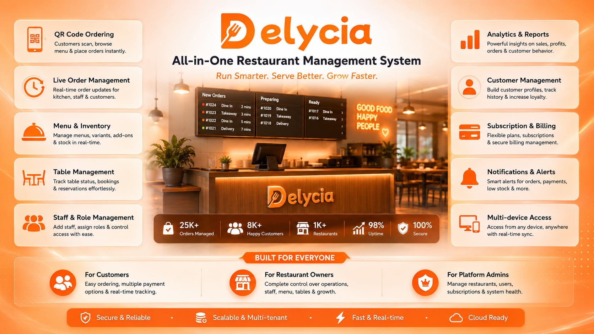
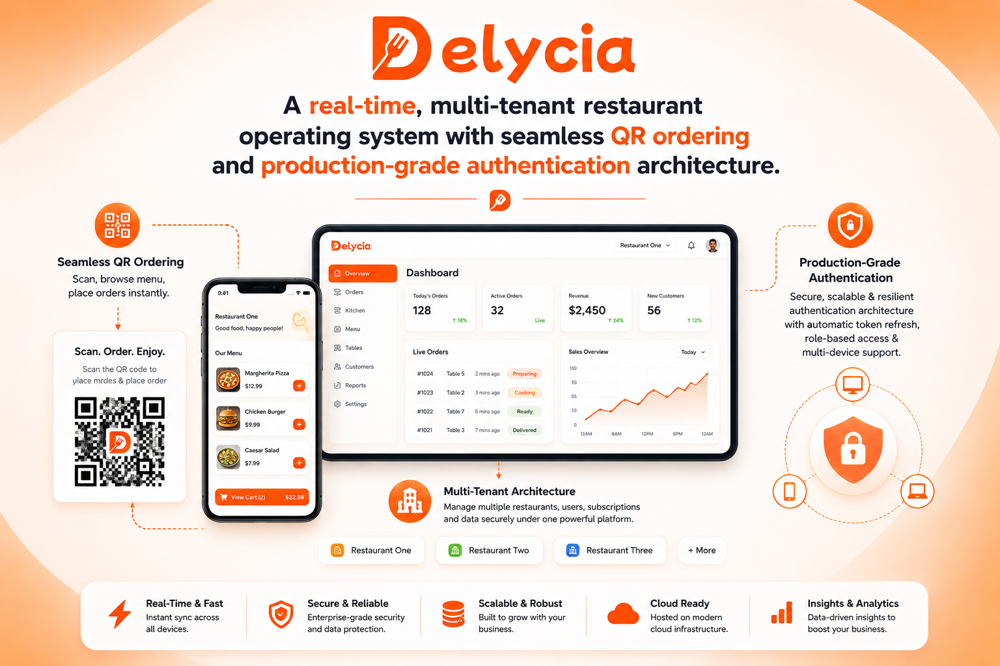
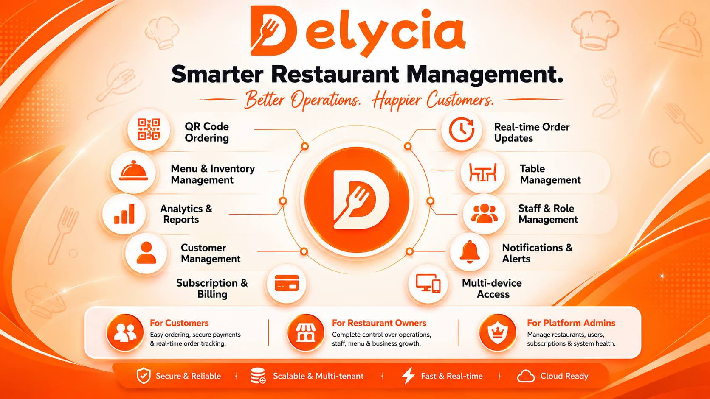
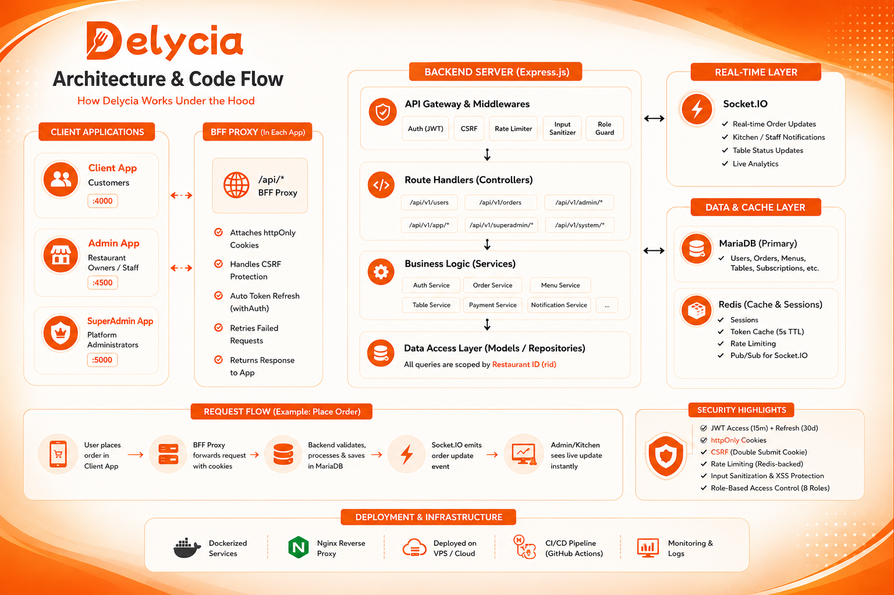

# 🍽️ Delycia

> **A next-generation, multi-tenant restaurant SaaS & real-time contactless ordering platform built with TanStack Ecosystem**



---

### ✦ Vision
Delycia is a production-ready, multi-tenant restaurant management platform designed to digitize dining experiences. Combining frictionless, instant QR-code customer ordering with a robust, real-time administrative workflow and automated subscription billing, Delycia serves as a unified operational suite for modern food-service businesses.

---

### ✦ Problem & Solution

| Problem | Delycia's Solution |
| :--- | :--- |
| **Manual & Paper Workflows** | Digitized, table-based QR-code menu browsing and ordering with zero application installation. |
| **Disconnected Kitchens** | Event-driven WebSocket synchronization keeping kitchen queues, waiters, and customers in perfect sync. |
| **High Aggregator Commissions** | A direct-to-consumer SaaS platform, bypassing costly third-party delivery marketplaces. |
| **Fragmented Management** | A centralized dashboard coordinating menus, multi-restaurant inventory, staff scheduling, and billing. |
| **Communication Delays** | Instant, bidirectional WebSocket event synchronization ensuring orders, table states, and kitchen workflows are updated in real-time. |

---


### ✦ Core Features

| Capability | Description |
| :--- | :--- |
| 🔄 **Real-Time Sync** | Event-driven WebSocket layer utilizing Socket.IO to instantly push order states, table occupancy, and kitchen updates to all connected devices. |
| 📱 **QR-Code Ordering** | Instant digital menu access, variant selection, addon customizers, and contactless checkout. |
| 📋 **Staff Workspace** | Dynamic real-time views for waiter order dispatching, kitchen queues, and delivery status tracking with audio alerts. |
| 🪑 **Table & Zone Control** | Comprehensive visual layout tracking, occupancy status management, and zone-based QR generation. |
| 👥 **Role-Based Permissions** | 8-tier staff hierarchy (Owner, Manager, Waiter, Kitchen, etc.) enforced via secure API middlewares. |
| 🍕 **Dynamic Inventory** | Intuitive control panels for menu items, variants, addons, categories, and item availability toggles. |
| 💳 **Multi-Tenant SaaS Billing**| Automated subscription plan management (Trial, Monthly, Yearly) with platform-wide analytics. |
| 🔍 **AI-Assisted Search** | Qdrant vector-backed smart menu exploration, customer memory logging, and dynamic upselling. |

---

### ✦ Real-Time Order Synchronization
Delycia is engineered with a high-performance event-driven architecture powered by Socket.IO. Order lifecycle events, table status transitions, and kitchen workflows propagate across customer interfaces and admin dashboards with sub-second latency, ensuring absolute synchronization across  entire staff.



---

### ✦ Platform Architecture & Feature Maps
Delycia scales efficiently by keeping the user-facing app, administration dashboard, and platform-wide superadmin dashboard isolated, all communicating through a secure Backend-for-Frontend (BFF) layer.





---

### ✦ Project Structure
```text
Delycia/
├── server/                     # Express.js REST API & WebSocket server
│   ├── src/
│   │   ├── config/             # Database connection pool & DB initialization scripts
│   │   ├── controller/v1/      # Scoped route controllers (web, admin, superadmin, app, system)
│   │   ├── routes/v1/          # Secure REST routes & role-based endpoints
│   │   ├── middlewares/        # JWT verification, CSRF Double Submit, rate limiting & XSS checks
│   │   ├── services/           # Redis services, session tracking, token caches & rate limiters
│   │   ├── sockets/            # Socket.IO handlers for live order & table status updates
│   │   ├── cron_jobs/          # Scheduled node-cron tasks (stats calculation, table resets)
│   │   ├── models/             # Relational data schema & helper queries
│   │   └── validations/        # Zod validation schemas for incoming requests
│   └── Dockerfile              # Containerization configuration for the backend
├── client/                     # TanStack Start customer-facing web application (:4000)
│   ├── src/
│   │   ├── routes/             # File-based routes & BFF proxy endpoints (/api/*)
│   │   ├── lib/                # BFF Auth helpers (withAuth, refreshCoordinator, circuitBreaker)
│   │   ├── hooks/              # Scoped TanStack Query query/mutation hooks
│   │   ├── context/            # AuthProvider & StoreProvider context definitions
│   │   └── store/              # Zustand lightweight UI and shopping cart state management
│   └── Dockerfile              # Containerization configuration for the client
├── admin/                      # TanStack Start restaurant operations dashboard (:4500)
│   ├── src/
│   │   ├── routes/             # Live orders queue, menu manager, staff tools & billing
│   │   ├── hooks/              # Socket.IO managers & multi-restaurant context switching
│   │   └── services/           # Local storage session, token, and cleanup utilities
│   └── Dockerfile              # Containerization configuration for the admin panel
├── superadmin/                 # TanStack Start platform super-admin panel (:5000)
│   ├── src/
│   │   └── routes/             # Tenant activation, subscription plan definitions & system health
│   └── Dockerfile              # Containerization configuration for the superadmin panel
└── landing/                    # Product marketing landing page
 
```
---

### ✦ Tech Stack

| Category | Technologies |
| :--- | :--- |
| 🌐 **Frontend Framework** | **TanStack Start** (SSR, file-based routing), Vite, TanStack Router |
| ⚡ **State & Query** | **TanStack Query**, Zustand, Axios |
| 🎨 **UI & Styling** | **Tailwind CSS**, Radix UI primitives, shadcn/ui, Framer Motion |
| ⚙️ **Backend & Logic** | **Express.js**, Node.js (ESM), `node-cron` |
| ☁️ **Database & Cache** | **MariaDB** (`mysql` pool), **Redis** (session & token caching) |
| 🔄 **Real-Time Layer** | **Socket.IO** (WebSocket server & client), Event-driven updates |
| 🔒 **Security & Auth** | JWT Access+Refresh Tokens, **BFF (Backend-for-Frontend) Pattern**, `csrf-csrf`, Rate Limiting |
| 🤖 **Intelligence & Search** | Google GenAI, OpenAI, Qdrant Vector Search |
 

---

### ✦ Getting Started
<details>
<summary><h3 style="display: inline;">1. Setup Environment</h3></summary>

Duplicate the environment sample configurations across the services:
```bash
# Backend Server
cp server/.env.example server/.env

# Client App
cp client/.env.sample client/.env

# Admin Panel
cp admin/.env.sample admin/.env

# SuperAdmin Panel
cp superadmin/.env.sample superadmin/.env
```

</details>

<details>
<summary><h3 style="display: inline;">2. Install Dependencies</h3></summary>

Install packages for the specific modules in your environment:
```bash
# Server (Backend)
cd server && npm install

# Client (Frontend)
cd ../client && pnpm install

# Admin Panel
cd ../admin && pnpm install

# SuperAdmin Panel
cd ../superadmin && pnpm install
```

</details>

<details>
<summary><h3 style="display: inline;">3. Database & Cache Initialization</h3></summary>

Make sure you have **MariaDB 11.8+** and **Redis 5.6+** active.
- **MariaDB Schema Setup**:
  ```bash
  mysql -u root -p < delycia_db_structure.sql
  ```
- **Redis Server Setup**:
  ```bash
  redis-server
  ```

</details>

<details>
<summary><h3 style="display: inline;">4. Run the Applications</h3></summary>

Launch each service in a separate terminal:
```bash
# Terminal 1 - Express API Server
cd server && npm run dev

# Terminal 2 - Customer Client App (Port 4000)
cd client && pnpm run dev

# Terminal 3 - Restaurant Admin Panel (Port 4500)
cd admin && pnpm run dev

# Terminal 4 - Platform SuperAdmin Panel (Port 5000)
cd superadmin && pnpm run dev
```

</details>

<details>
<summary><h3 style="display: inline;">5. Local Access Points</h3></summary>

* 🌐 **Customer Portal**: `http://localhost:4000`
* ⚙️ **Restaurant Admin**: `http://localhost:4500`
* 👑 **Platform SuperAdmin**: `http://localhost:5000`
* 🔌 **API Engine & Health**: `http://localhost:3000`

</details>


---
  
<div align="center">
   
  <br />
  <sub>Under the MIT License | Made with 🧡 by Sayan, powered by ☕</sub>
  <br />
  <p style="margin:1px 0; font-size:18px;">   
  
</div>
