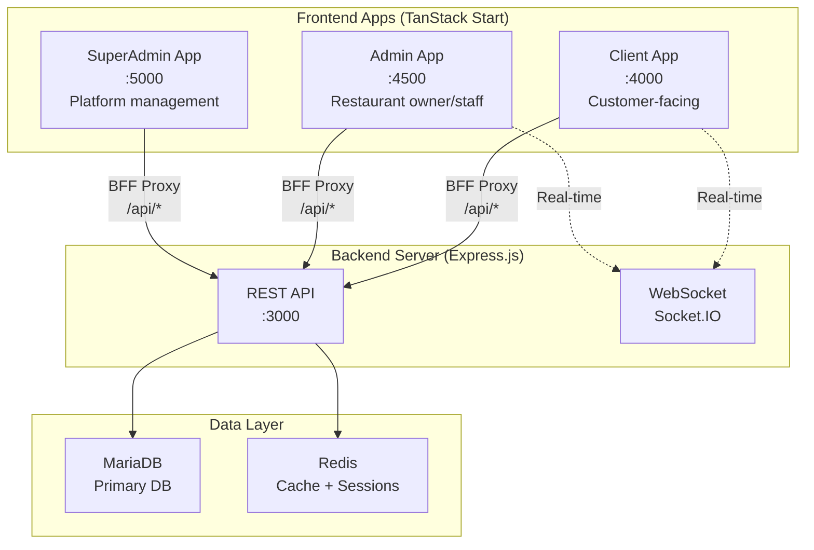
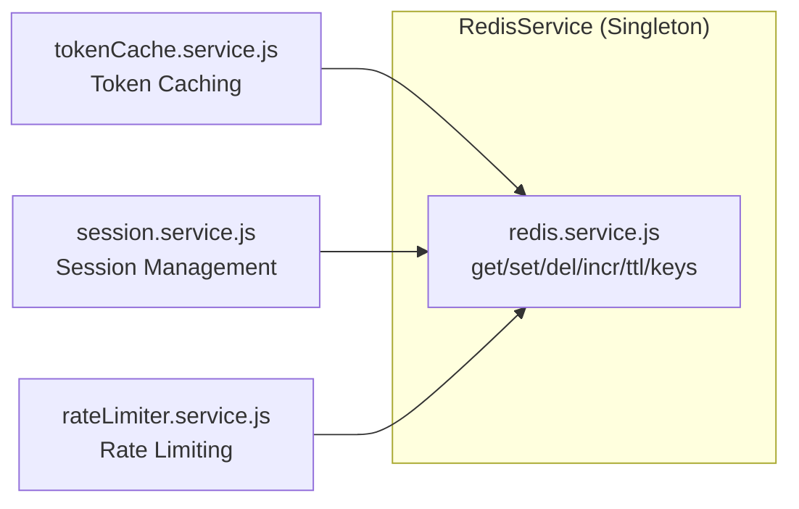
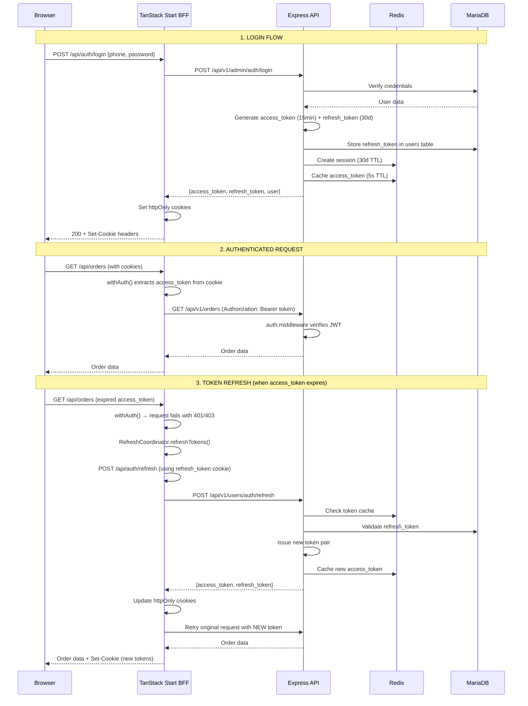
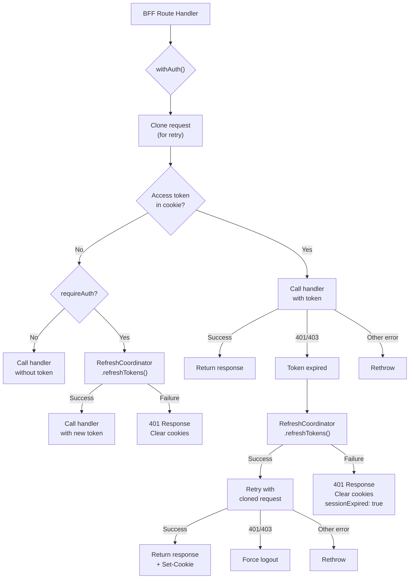
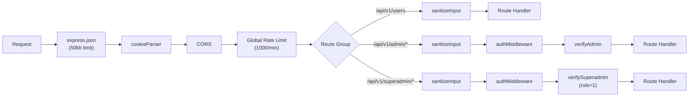
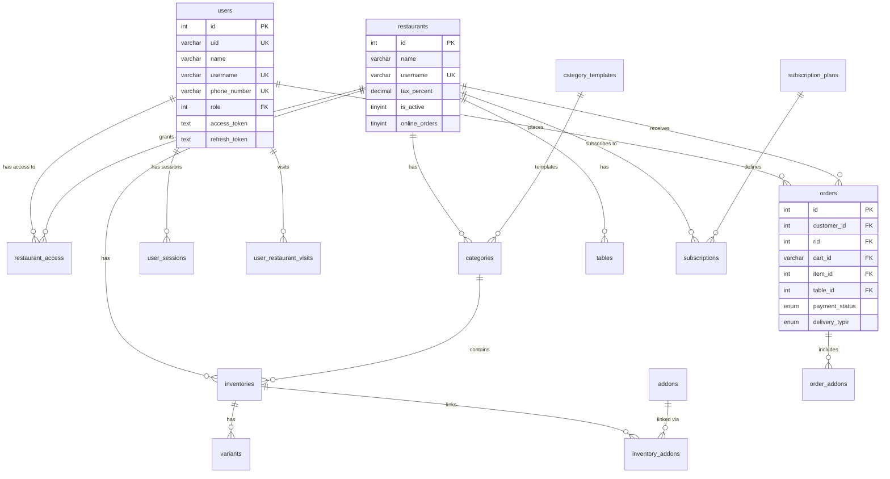
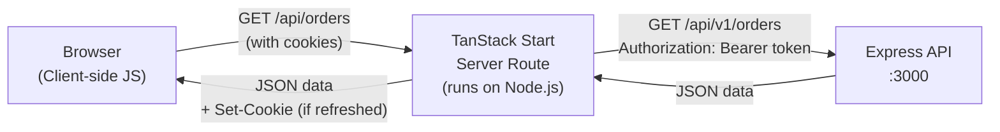
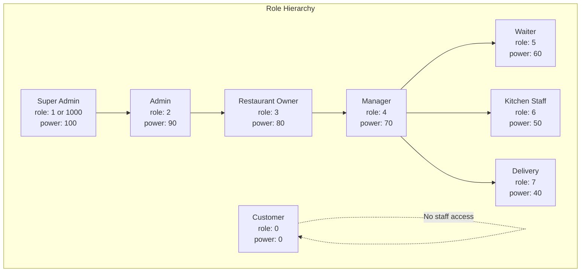

# Delycia — Full Architecture Analysis

> **Platform**: Restaurant SaaS (multi-tenant)
> **Migrated From**: Next.js → TanStack Start
> **Date**: 2026-04-03

---

## 1. High-Level Overview

Delycia is a **multi-tenant restaurant management SaaS** platform. It allows restaurant owners to manage menus, orders, tables, staff, and customers — all from a centralized system with a per-restaurant subscription model.



---

## 2. Monorepo Structure

```
Delycia/
├── server/          # Express.js REST API + WebSocket server
├── client/          # TanStack Start — customer-facing app (:4000)
├── admin/           # TanStack Start — restaurant admin panel (:4500)
├── superadmin/      # TanStack Start — platform super-admin (:5000)
├── landing/         # Landing/marketing page
├── design/          # Design assets
├── skills/          # AI/agent skills
└── delycia_db_structure.sql  # Full MariaDB schema dump
```

> [!IMPORTANT]
> Each frontend app (`client`, `admin`, `superadmin`) is an **independent TanStack Start application** with its own `package.json`, `vite.config.ts`, routing, and build pipeline. They are NOT a monorepo workspace — they share structure conventions but are deployed separately.

---

## 3. Technology Stack

### 3.1 Backend (`server/`)

| Layer | Technology |
|-------|-----------|
| **Runtime** | Node.js (ESM) |
| **Framework** | Express.js v4 |
| **Database** | MariaDB 11.8 via `mysql2` (connection pool, 50 connections) |
| **Cache/Sessions** | Redis v5.6 (`redis` npm) |
| **Auth** | JWT (`jsonwebtoken`) — access + refresh tokens |
| **Real-time** | Socket.IO v4 |
| **Rate Limiting** | `express-rate-limit` + custom Redis-based limiter |
| **CSRF** | `csrf-csrf` (Double Submit Cookie pattern) |
| **AI** | Google GenAI, OpenAI |
| **Search** | Qdrant vector DB |
| **Jobs** | `node-cron` scheduled tasks |
| **QR Codes** | `qrcode` |

### 3.2 Frontend Apps (`client/`, `admin/`, `superadmin/`)

| Layer | Technology |
|-------|-----------|
| **Framework** | TanStack Start (file-based routing with SSR) |
| **Build** | Vite v7 |
| **Routing** | TanStack Router (file-based, type-safe) |
| **State** | TanStack Query v5 + Zustand |
| **UI** | Radix UI primitives + shadcn/ui |
| **Styling** | Tailwind CSS v4 |
| **Forms** | react-hook-form + zod |
| **HTTP** | Axios |
| **Animation** | Framer Motion |
| **Icons** | Lucide React, Tabler Icons, MUI Icons |
| **Real-time** | Socket.IO Client |

---

## 4. Server Architecture (`server/src/`)

```
server/src/
├── index.js                  # Entry point — starts Express + Redis
├── app.js                    # Express app config, CORS, routes
├── config/
│   ├── db.connection.js      # MariaDB connection pool
│   └── db.Init.js            # DB initialization
├── controller/v1/
│   ├── web/                  # Customer-facing controllers
│   ├── admin/                # Restaurant admin controllers
│   ├── superadmin/           # Platform admin controllers
│   ├── app/                  # Mobile/QR app controllers
│   └── system/               # System/internal controllers
├── routes/v1/
│   ├── web/                  # /api/v1/users, /api/v1/orders, etc.
│   ├── admin/                # /api/v1/admin/*
│   ├── superadmin/           # /api/v1/superadmin/*
│   ├── app/                  # /api/v1/app/*
│   └── system/               # /api/v1/system/*
├── middlewares/
│   ├── auth.middleware.js     # JWT verification (all users)
│   ├── admin.middleware.js    # Admin role check
│   ├── superadmin.middleware.js # Superadmin role check (role=1 or 1000)
│   ├── csrf.middleware.js     # CSRF Double Submit Cookie
│   ├── rateLimiter.middleware.js # Redis-backed rate limiting
│   ├── sanitizeInputs.middleware.js # XSS/injection prevention
│   └── ws.auth.middleware.js  # WebSocket authentication
├── services/
│   ├── redis.service.js       # Redis singleton client
│   ├── session.service.js     # Redis-based session management
│   ├── tokenCache.service.js  # Redis-based token caching
│   └── rateLimiter.service.js # Redis-based rate limiting
├── sockets/                   # Socket.IO namespaces
├── cron_jobs/                 # Scheduled background tasks
├── jobs/                      # Job scheduler
├── helpers/                   # Utility helpers
├── utils/                     # Shared utilities
├── models/                    # Data models
└── validations/               # Request validation schemas
```

### 4.1 API Route Groups

| Prefix | Purpose | Auth Required |
|--------|---------|---------------|
| `/api/v1/users/auth` | Customer auth (login, register, OTP) | No |
| `/api/v1/users` | Customer profile | Yes (JWT) |
| `/api/v1/orders` | Customer orders | Yes (JWT) |
| `/api/v1/inventory` | Menu browsing (public data) | Partial |
| `/api/v1/restaurant` | Restaurant info (public) | No |
| `/api/v1/tables` | Table management | Yes (JWT) |
| `/api/v1/sessions` | Session management | Yes (JWT) |
| `/api/v1/admin/auth` | Admin login | No |
| `/api/v1/admin/*` | Admin dashboard, inventory, orders, CRM, etc. | Yes (JWT + Admin) |
| `/api/v1/superadmin/auth` | Superadmin login | No |
| `/api/v1/superadmin/*` | Platform management | Yes (JWT + Superadmin) |
| `/api/v1/app/*` | QR codes, temp sessions, voice | Varies |
| `/api/v1/system/*` | Embeddings, cron jobs, upsells | Internal |

---

## 5. Redis Implementation

> [!NOTE]
> Redis is implemented **only on the backend server** (`server/src/services/`). The frontend apps never talk to Redis directly — they interact with it through the backend REST API.

Redis is used for **three distinct purposes**, all via a single `RedisService` singleton:

### 5.1 Redis Service (`redis.service.js`)

- **Singleton** pattern — one connection shared across the entire server
- Auto-reconnection with **exponential backoff** (1s, 2s, 4s... max 30s, 10 attempts)
- **Graceful degradation** — all operations return fallback values if Redis is down
- Health check endpoint at `GET /health/redis`
- Connection initialized non-blockingly on server startup



### 5.2 Token Cache (`tokenCache.service.js`)

| Aspect | Detail |
|--------|--------|
| **Purpose** | Cache access tokens to reduce backend auth load by ~80% |
| **Key format** | `delycia:token:{last-32-chars-of-refresh-token}` |
| **TTL** | 5 seconds |
| **Operations** | `cacheToken()`, `getCachedToken()`, `invalidateToken()`, `invalidateUserTokens()` |
| **Metrics** | hit/miss/error counters exposed at `/health/cache` |

### 5.3 Session Management (`session.service.js`)

| Aspect | Detail |
|--------|--------|
| **Purpose** | Track user sessions across multiple devices |
| **Key format (session)** | `delycia:session:{uuid}` |
| **Key format (user lookup)** | `delycia:user:sessions:{userId}` |
| **TTL** | 30 days |
| **Stored data** | sessionId, userId, refreshToken, deviceType, browser, OS, IP, timestamps |
| **Operations** | `createSession()`, `getSession()`, `getSessionByRefreshToken()`, `updateSessionActivity()`, `deleteSession()`, `getUserSessions()`, `deleteUserSessions()`, `cleanupExpiredSessions()` |
| **Metrics** | Stats exposed at `/health/sessions` |

### 5.4 Rate Limiter (`rateLimiter.service.js`)

| Aspect | Detail |
|--------|--------|
| **Purpose** | Prevent abuse of refresh/login/API endpoints |
| **Key format** | `delycia:ratelimit:{type}:{action}:{identifier}` |
| **Algorithm** | Sliding window counter |
| **User limits** | 5 refresh/min, 5 login/5min |
| **IP limits** | 10 refresh/min, 10 login/5min, 100 API/min |
| **Fail mode** | Fail open (allow on Redis error) |
| **Metrics** | Stats exposed at `/health/ratelimit` |

---

## 6. Authentication & Session Management

### 6.1 Token Architecture

The system uses a **dual JWT token** strategy:

| Token | Lifetime | Storage | Purpose |
|-------|----------|---------|---------|
| **Access Token** | 15 minutes | httpOnly cookie | API authorization (short-lived) |
| **Refresh Token** | 30 days | httpOnly cookie + DB + Redis | Token renewal (long-lived) |

> [!IMPORTANT]
> Token cookie names differ per app:
> - **Client**: `access_token`, `refresh_token`
> - **Admin**: `admin_access_token`, `admin_refresh_token`
> - **Superadmin**: Uses superadmin-specific cookies

### 6.2 Token Lifecycle



### 6.3 Dual Storage: DB + Redis Sessions

The system maintains sessions in **two places**:

| Storage | Table/Key | Purpose |
|---------|-----------|---------|
| **MariaDB** | `user_sessions` table | Persistent audit trail, survives Redis restart |
| **Redis** | `delycia:session:{id}` | Fast lookup, TTL-based expiry, multi-device tracking |

The `user_sessions` table in MariaDB stores:
- `user_id`, `refresh_token`, `device_info`, `ip_address`, `user_agent`
- `created_at`, `last_used_at`, `expires_at`

Redis sessions add real-time capabilities: activity tracking, device info parsing, multi-device logout.

---

## 7. What is `withAuth()`?

> [!IMPORTANT]
> `withAuth()` is the **core BFF (Backend-for-Frontend) auth helper** used in TanStack Start server routes. It is the central mechanism that makes the httpOnly cookie authentication work transparently.

### 7.1 Purpose

`withAuth()` is a server-side function that wraps any BFF API route handler. It:

1. **Extracts** the access token from httpOnly cookies
2. **Passes** it to your handler function
3. **Catches** 401/403 errors (token expired)
4. **Refreshes** the token automatically via `RefreshCoordinator`
5. **Retries** the original request with the new token
6. **Sets** updated cookies in the response

### 7.2 Where It's Used

`withAuth()` exists in **two implementations**:

| File | App | Cookie Names |
|------|-----|-------------|
| [client/src/lib/withAuth.ts](file:///mnt/SharedFolders/Documents/Coding/Tanstack-Start/Delycia/client/src/lib/withAuth.ts) | Client | `access_token`, `refresh_token` |
| [admin/src/lib/withAuth.ts](file:///mnt/SharedFolders/Documents/Coding/Tanstack-Start/Delycia/admin/src/lib/withAuth.ts) | Admin | `admin_access_token`, `admin_refresh_token` |

### 7.3 Usage Pattern

Every authenticated BFF route follows this pattern:

```typescript
// Example: admin/src/routes/api/orders.ts
export const ServerRoute = createServerFileRoute('/api/orders').methods({
  GET: async ({ request }) => {
    return withAuth(request, async (accessToken, authHeaders, req) => {
      const res = await axiosInstance.get('/admin/orders', {
        headers: { Authorization: `Bearer ${accessToken}` },
      })
      return jsonResponse(res.data, 200, authHeaders)
    })
  },
})
```

### 7.4 Flow Diagram



### 7.5 Key Design Decisions

| Decision | Rationale |
|----------|-----------|
| **Request cloning** | `request.clone()` before first attempt — allows body re-read on retry |
| **Single retry** | Prevents infinite refresh loops (`_isRetry` flag in admin) |
| **RefreshCoordinator** | Deduplicates concurrent refresh attempts (Promise-based singleton) |
| **Circuit breaker** | Opens after 5 consecutive failures, blocks for 30s |
| **Exponential backoff** | 1s → 2s → 4s retry delays |
| **Cookie scoping** | Admin uses `admin_` prefix to avoid cookie collision with client |
| **Timeout handling** | Returns 504 on backend timeout (ECONNABORTED/ETIMEDOUT) |

---

## 8. RefreshCoordinator

The `RefreshCoordinator` is a **singleton** that ensures only one token refresh happens at a time, even when multiple concurrent BFF requests detect an expired token.

| Feature | Detail |
|---------|--------|
| **Pattern** | Promise-based deduplication |
| **Retry** | 3 attempts with exponential backoff (1s, 2s, 4s) |
| **Circuit breaker** | Opens after 5 failures, tries again after 30s |
| **Rate limit handling** | Honors 429 responses, stops retrying |
| **Singleton** | One per process (server-side) |

Files:
- [client/src/lib/refreshCoordinator.ts](file:///mnt/SharedFolders/Documents/Coding/Tanstack-Start/Delycia/client/src/lib/refreshCoordinator.ts)
- [admin/src/lib/refreshCoordinator.ts](file:///mnt/SharedFolders/Documents/Coding/Tanstack-Start/Delycia/admin/src/lib/refreshCoordinator.ts)

---

## 9. Server Middleware Chain

Requests flow through these middlewares in order:



### 9.1 Middleware Details

| Middleware | File | Purpose |
|-----------|------|---------|
| `authMiddleware` | [auth.middleware.js](file:///mnt/SharedFolders/Documents/Coding/Tanstack-Start/Delycia/server/src/middlewares/auth.middleware.js) | Verifies JWT from `Authorization` header or `access_token` cookie. Attaches `req.user`. Returns 401 (no token) or 403 (invalid/expired). |
| `verifyAdmin` | [admin.middleware.js](file:///mnt/SharedFolders/Documents/Coding/Tanstack-Start/Delycia/server/src/middlewares/admin.middleware.js) | Checks user exists in DB by `uid`. Simple existence check. |
| `verifySuperadmin` | [superadmin.middleware.js](file:///mnt/SharedFolders/Documents/Coding/Tanstack-Start/Delycia/server/src/middlewares/superadmin.middleware.js) | Checks user has `role = 1` (Super Admin) in DB. |
| `sanitizeInput` | sanitizeInputs.middleware.js | XSS/injection prevention on all inputs. |
| `csrfProtection` | [csrf.middleware.js](file:///mnt/SharedFolders/Documents/Coding/Tanstack-Start/Delycia/server/src/middlewares/csrf.middleware.js) | Double Submit Cookie CSRF pattern for state-changing operations. |
| `rateLimiter` | rateLimiter.middleware.js | Redis-backed per-user and per-IP rate limiting. |

---

## 10. Database Schema (MariaDB)

> Database: `u419451251_Delycia_DB` on MariaDB 11.8

### 10.1 Core Tables



### 10.2 Table Inventory

| Table | Purpose |
|-------|---------|
| `users` | All user accounts (customers, admins, staff, superadmin) |
| `roles` | Role definitions (0=Customer, 1=SuperAdmin, 2=Admin, 3=Owner, 4=Manager, 5=Waiter, 6=Kitchen, 7=Delivery) |
| `restaurants` | Restaurant profiles and settings |
| `restaurant_access` | Many-to-many: which users have access to which restaurants |
| `categories` | Menu categories per restaurant |
| `category_templates` | Shared category templates across restaurants |
| `inventories` | Menu items (food) |
| `variants` | Item size/price variants |
| `addons` | Extra toppings/sides |
| `inventory_addons` | Many-to-many: which addons available for which items |
| `orders` | Individual order line items |
| `order_addons` | Addons attached to specific orders |
| `carts` | Cart grouping for multi-item orders |
| `tables` | Restaurant table management (number, capacity, zone, status) |
| `subscriptions` | Active restaurant subscriptions |
| `subscription_plans` | Available plans (trial, monthly, yearly) |
| `user_sessions` | Persistent session tracking (refresh tokens) |
| `user_restaurant_visits` | CRM: visit tracking per user per restaurant |
| `temp_sessions` | QR code scan temporary sessions |
| `notifications` | In-app notification system |
| `coupon_codes` | Discount codes |
| `favourite_list` | User favorites |
| `memories` | AI-related user memories |
| `cities` | Indian cities lookup (for registration) |
| `config` | System configuration |
| `login_tokens` | OTP/magic link tokens |
| `inventory_stats` | Precomputed item analytics (popularity, revenue) |
| `qr_codes` | Generated QR codes |
| `restaurant_hours` | Operating hours per day |

### 10.3 Stored Procedures & Triggers

| Name | Purpose |
|------|---------|
| `sp_refresh_inventory_stats` | Recomputes order_count, units_sold, revenue, popularity_score |
| `sp_reset_occupied_tables` | Auto-resets tables occupied for >1 hour |
| `trg_update_inventories_status_on_category_change` | Cascades category active/inactive to items |
| `trg_update_inventories_status_on_category_update` | Same as above but on UPDATE |

---

## 11. Frontend Architecture

### 11.1 Client App (`client/`)

The **customer-facing** app for browsing restaurants, viewing menus, placing orders.

```
client/src/
├── routes/
│   ├── __root.tsx           # Root layout + AuthProvider
│   ├── index.tsx            # Home page
│   ├── $username.tsx        # Restaurant page (dynamic)
│   ├── category.tsx         # Category browsing
│   ├── cart.tsx / checkout.tsx / order-placed.tsx
│   ├── orders.tsx           # Order history
│   ├── auth/                # Login, register
│   ├── user/                # User profile
│   └── api/                 # BFF server routes
│       ├── auth/session.ts  # Session validation
│       ├── users.ts         # User CRUD
│       ├── orders.ts        # Orders
│       ├── inventory.ts     # Menu items
│       ├── categories.ts    # Categories
│       ├── tables.ts        # Table management
│       └── restaurant.checkout.ts
├── lib/
│   ├── withAuth.ts          # BFF auth helper
│   ├── refreshCoordinator.ts # Token refresh dedup
│   ├── circuitBreaker.ts    # Circuit breaker pattern
│   └── server-cookies.ts    # Cookie parsing utilities
├── hooks/
│   ├── queries/             # TanStack Query hooks
│   ├── mutations/           # TanStack Mutation hooks
│   ├── useSessionStatus.ts  # Session expiry monitoring
│   └── useRestaurantUsername.tsx
├── context/
│   ├── AuthProvider.tsx     # Auth wrapper (thin; logic in useAuthQuery)
│   └── StoreProvider.tsx    # Zustand store provider
├── store/                   # Zustand state management
├── services/                # API service layer
├── config/                  # App configuration
├── schemas/                 # Zod validation schemas
└── types/                   # TypeScript types
```

### 11.2 Admin App (`admin/`)

The **restaurant dashboard** for owners and staff. Manages orders, inventory, tables, staff, QR codes, reports, billing.

```
admin/src/
├── routes/
│   ├── __root.tsx           # Root layout with auth gate
│   ├── login.tsx            # Admin login
│   ├── dashboard.tsx        # Analytics dashboard
│   ├── inventory/           # Menu management
│   ├── orders/              # Order management (real-time)
│   ├── staff/               # Staff management
│   ├── reports/             # Analytics reports
│   ├── settings/            # Restaurant settings
│   ├── billing/             # Subscription billing
│   ├── qr-codes.tsx         # QR code generator
│   └── api/                 # BFF server routes (50+ endpoints)
├── lib/
│   ├── withAuth.ts          # BFF auth (admin cookies)
│   ├── refreshCoordinator.ts # Admin-specific refresh
│   ├── circuitBreaker.ts
│   ├── axios.ts             # Axios instance config
│   └── server-cookies.ts
├── hooks/
│   ├── useAuth.ts           # Full auth state management
│   ├── useDashboardData.ts  # Dashboard analytics
│   ├── useWebSocketManager.ts # Real-time order updates
│   ├── useRestaurantSelector.tsx # Multi-restaurant switching
│   └── useSessionStatus.ts
├── services/
│   ├── sessionService.ts    # Client-side session (localStorage)
│   ├── sessionCleanupService.ts # Auto-cleanup
│   └── tokenService.ts      # Client-side token management
└── middleware/               # Route-level middleware
```

### 11.3 SuperAdmin App (`superadmin/`)

The **platform management** panel for managing all restaurants, users, subscriptions, and system health.

```
superadmin/src/
├── routes/
│   ├── __root.tsx          # Root layout
│   ├── login.tsx           # Superadmin login
│   ├── dashboard.tsx       # Platform overview
│   ├── restaurants/        # Manage all restaurants
│   ├── users/              # Manage all users
│   ├── subscriptions/      # Subscription management
│   ├── menus/              # Menu template management
│   ├── staff/              # Staff across restaurants
│   └── api/                # BFF routes
├── services/
│   ├── sessionService.ts
│   └── tokenService.ts
├── hooks/                  # Custom hooks
├── middleware/             # Auth middleware
└── schemas/                # Validation schemas
```

---

## 12. BFF (Backend-for-Frontend) Pattern

> [!NOTE]
> The frontend apps NEVER call the Express backend directly from the browser. All API calls go through TanStack Start **server routes** that act as a BFF proxy.



**Why BFF?**
1. **Security**: httpOnly cookies never exposed to JavaScript
2. **Token refresh**: Automatic and transparent to the client
3. **Cookie management**: Server-side cookie reading/writing
4. **CORS simplification**: Same-origin requests from browser perspective

---

## 13. Role-Based Access Control (RBAC)



| Role | App Access | Capabilities |
|------|-----------|--------------|
| Customer (0) | Client | Browse, order, pay |
| Waiter (5) | Admin | View/create/update orders |
| Kitchen (6) | Admin | Order management |
| Delivery (7) | Admin | Track deliveries |
| Manager (4) | Admin | Full restaurant operations |
| Owner (3) | Admin | Full control of own restaurant |
| Admin (2) | Admin | High-level management |
| SuperAdmin (1/1000) | SuperAdmin | Full system control |

---

## 14. Real-Time Layer (WebSocket)

```
server/src/sockets/
├── index.js              # Socket.IO namespace setup
└── namespaces/           # Event handlers per namespace
```

Socket.IO is used for **real-time order updates** in the admin panel:
- New order notifications
- Order status changes
- Table status updates
- Kitchen display system updates

The admin app connects via `useWebSocketManager.ts` hook.

---

## 15. Deployment Architecture

Each app has its own `Dockerfile` and `docker-compose.yml`:

| Service | Port | Dockerfile |
|---------|------|-----------|
| Server (API) | 3000 | `server/Dockerfile` |
| Client | 4000 | `client/Dockerfile` |
| Admin | 4500 | `admin/Dockerfile` |
| SuperAdmin | 5000 | `superadmin/Dockerfile` |
| MariaDB | 3306 | Managed service |
| Redis | 6379 | Managed service |

---

## 16. Key Architectural Patterns Summary

| Pattern | Where | Purpose |
|---------|-------|---------|
| **BFF (Backend-for-Frontend)** | All frontend apps | Proxy API calls, manage httpOnly cookies |
| **withAuth() wrapper** | All BFF routes | Transparent token refresh |
| **RefreshCoordinator (Singleton)** | Per frontend app | Deduplicate concurrent refresh attempts |
| **Circuit Breaker** | RefreshCoordinator | Prevent cascading failures |
| **Graceful Degradation** | All Redis services | App works without Redis (reduced features) |
| **Dual Token Strategy** | Auth system | Short-lived access + long-lived refresh |
| **Double Submit Cookie** | CSRF | Protect state-changing operations |
| **Multi-tenant scoping** | DB queries (`rid` param) | Restaurant isolation via restaurant ID |
| **Role-based middleware chain** | Server routes | `auth → admin/superadmin → handler` |
| **Event-driven real-time** | Socket.IO | Live order & table updates |
